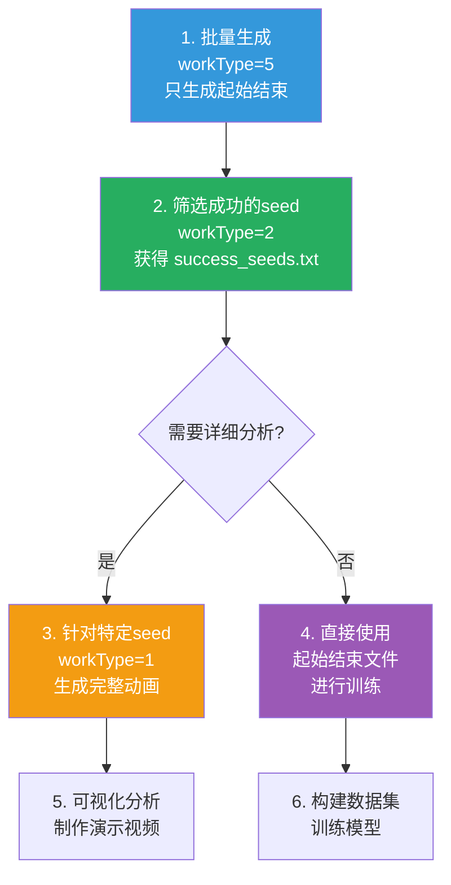

# 动画生成模式说明

## 概述

`generateAnimationSequence` 函数用于生成碰撞场景的动画序列，支持多种生成模式。

## 函数签名

```cpp
void generateAnimationSequence(
    const CollisionPoint& cp,      // 碰撞点信息
    double timeStart,              // 起始时间
    double timeEnd,                // 结束时间
    double deltaTime,              // 时间步长
    std::string outputDir = "Animation",        // 输出目录
    bool generateStartEnd = true,  // 是否只生成起始和结束
    unsigned seed = 0,             // 随机种子
    bool generateFrames = true     // 是否生成每一帧的obj
)
```

## 参数说明

| 参数 | 类型 | 默认值 | 说明 |
|------|------|--------|------|
| `cp` | `CollisionPoint` | - | 碰撞点信息（包含两个patch和速度） |
| `timeStart` | `double` | - | 起始时间（通常为0） |
| `timeEnd` | `double` | - | 结束时间（通常为1.0） |
| `deltaTime` | `double` | - | 时间步长（如0.01表示生成100帧） |
| `outputDir` | `string` | `"Animation"` | 输出目录前缀 |
| `generateStartEnd` | `bool` | `true` | 是否只生成起始和结束的patch |
| `seed` | `unsigned` | `0` | 随机种子（用于目录命名） |
| `generateFrames` | `bool` | `true` | 是否生成每一帧的obj文件 |

## 生成模式

### 模式对比

```mermaid
flowchart TD
    A["generateAnimationSequence"] --> B{"generateStartEnd?"}
    
    B -->|"true"| C["只生成起始和结束<br/>4个文件"]
    B -->|"false"| D{"generateFrames?"}
    
    D -->|"true"| E["生成完整动画<br/>4个起始结束 + N帧"]
    D -->|"false"| F["只生成起始和结束<br/>4个文件"]
    
    C --> C1["patch1_start.obj<br/>patch1_end.obj<br/>patch2_start.obj<br/>patch2_end.obj"]
    
    E --> E1["patch1_start.obj<br/>patch1_end.obj<br/>patch2_start.obj<br/>patch2_end.obj<br/>frame_0000.obj<br/>frame_0001.obj<br/>...<br/>frame_0100.obj"]
    
    F --> F1["patch1_start.obj<br/>patch1_end.obj<br/>patch2_start.obj<br/>patch2_end.obj"]
    
    style A fill:#3498db,color:#fff
    style C fill:#27ae60,color:#fff
    style E fill:#f39c12,color:#fff
    style F fill:#9b59b6,color:#fff
```



### 模式 1：只生成起始和结束（快速模式）

**参数组合**：
```cpp
generateAnimationSequence(cp, 0, 1.0, 0.01, "Animation", true, seed, true);
// 或
generateAnimationSequence(cp, 0, 1.0, 0.01, "Animation", false, seed, false);
```

**输出文件**：
```
Animation_seed1234567890/
├── patch1_start.obj    # patch1 在 t=0 的位置
├── patch1_end.obj      # patch1 在 t=1 的位置
├── patch2_start.obj    # patch2 在 t=0 的位置
└── patch2_end.obj      # patch2 在 t=1 的位置
```

**用途**：
- ✅ 快速验证场景生成是否正确
- ✅ 批量生成大量数据时节省磁盘空间
- ✅ 只需要起始和结束状态的场景

**使用场景**：
- `workType=5` 批量 seed 生成模式

### 模式 2：生成完整动画序列

**参数组合**：
```cpp
generateAnimationSequence(cp, 0, 1.0, 0.01, "Animation", false, seed, true);
```

**输出文件**：
```
Animation_seed1234567890/
├── patch1_start.obj    # patch1 在 t=0 的位置
├── patch1_end.obj      # patch1 在 t=1 的位置
├── patch2_start.obj    # patch2 在 t=0 的位置
├── patch2_end.obj      # patch2 在 t=1 的位置
├── frame_0000.obj      # t=0.00 时刻的两个patch
├── frame_0001.obj      # t=0.01 时刻的两个patch
├── frame_0002.obj      # t=0.02 时刻的两个patch
├── ...
└── frame_0100.obj      # t=1.00 时刻的两个patch
```

**用途**：
- ✅ 生成完整的动画序列用于可视化
- ✅ 详细分析碰撞过程
- ✅ 制作演示视频

**使用场景**：
- `workType=1` 单例生成模式
- 需要详细分析的特定场景

## 不同 workType 的调用方式

### workType=1：单例生成（完整动画）

```cpp
auto ok = testAdditionalCollisions(cp, taskType);
if(!ok)
    generateAnimationSequence(cp, 0, 1.0, 0.01, outputDir, false, seed);
    // generateFrames 默认为 true，生成完整动画
```

**输出**：
- 4个起始结束文件
- 101个动画帧文件（frame_0000.obj ~ frame_0100.obj）

### workType=5：批量生成（只生成起始结束）

```cpp
if (!ok) {
    // 生成动画序列（不生成每一帧，只生成起始和结束）
    generateAnimationSequence(cp, 0, 1.0, 0.01, outputDir, false, currentSeed, false);
    std::cout << "Success: Animation generated for seed " << currentSeed << std::endl;
    successCount++;
}
```

**输出**：
- 4个起始结束文件
- **不生成**动画帧文件

**优势**：
- 🚀 **速度快**：不生成100+个帧文件，处理速度大幅提升
- 💾 **节省空间**：每个场景只占用约 4KB（4个文件），而不是 400KB+（105个文件）
- 📊 **适合批量**：处理1000个seed时，节省约 400MB 磁盘空间

## 性能对比

### 单个场景的文件大小

| 模式 | 文件数量 | 磁盘占用 | 生成时间 |
|------|---------|---------|---------|
| 只生成起始结束 | 4 | ~4 KB | ~0.01s |
| 生成完整动画 | 105 | ~400 KB | ~0.5s |

### 批量生成 1000 个场景

| 模式 | 总文件数 | 总磁盘占用 | 总时间 |
|------|---------|-----------|--------|
| 只生成起始结束 | 4,000 | ~4 MB | ~10s |
| 生成完整动画 | 105,000 | ~400 MB | ~500s |

**结论**：批量生成时使用"只生成起始结束"模式可以节省 **100倍** 的磁盘空间和 **50倍** 的时间。

## 使用建议

### 推荐工作流程



### 场景选择指南

| 需求 | 推荐模式 | workType | generateFrames |
|------|---------|----------|----------------|
| 快速验证场景 | 只生成起始结束 | 5 | false |
| 批量生成数据集 | 只生成起始结束 | 5 | false |
| 详细分析碰撞 | 生成完整动画 | 1 | true |
| 制作演示视频 | 生成完整动画 | 1 | true |
| 调试特定场景 | 生成完整动画 | 1 | true |

## 代码示例

### 示例 1：批量生成（节省空间）

```bash
# 从 seed 文件批量生成，只生成起始结束
./generator -g 5 -i seeds.txt -t 12 -o BatchData

# 结果：每个场景只有 4 个文件
ls BatchData_seed1234567890/
# patch1_start.obj  patch1_end.obj  patch2_start.obj  patch2_end.obj
```

### 示例 2：单例生成（完整动画）

```bash
# 生成单个场景的完整动画
./generator -g 1 -t 12 -o DetailedAnimation

# 结果：包含 105 个文件
ls DetailedAnimation_seed*/
# patch1_start.obj  patch1_end.obj  patch2_start.obj  patch2_end.obj
# frame_0000.obj  frame_0001.obj  ...  frame_0100.obj
```

### 示例 3：先批量后详细

```bash
# 步骤1：批量生成 1000 个场景（快速）
./generator -g 5 -i seeds_1000.txt -t 12 -o QuickBatch

# 步骤2：批处理，筛选成功的 seed
./generator -g 2 -i QuickBatch -t 12

# 步骤3：针对感兴趣的 seed 生成完整动画
# 手动编辑 interesting_seeds.txt，只包含几个 seed
./generator -g 5 -i interesting_seeds.txt -t 12 -o DetailedAnalysis
# 然后手动修改代码，将 generateFrames 改为 true
```

## 目录结构对比

### 只生成起始结束（workType=5）

```
BatchData_seed1234567890/
├── patch1_start.obj    (1 KB)
├── patch1_end.obj      (1 KB)
├── patch2_start.obj    (1 KB)
└── patch2_end.obj      (1 KB)
Total: 4 KB
```

### 生成完整动画（workType=1）

```
DetailedAnimation_seed1234567890/
├── patch1_start.obj    (1 KB)
├── patch1_end.obj      (1 KB)
├── patch2_start.obj    (1 KB)
├── patch2_end.obj      (1 KB)
├── frame_0000.obj      (4 KB)
├── frame_0001.obj      (4 KB)
├── frame_0002.obj      (4 KB)
├── ...
└── frame_0100.obj      (4 KB)
Total: 408 KB
```

## 注意事项

1. **参数优先级**：
   - 如果 `generateStartEnd=true`，则无论 `generateFrames` 是什么，都只生成起始结束
   - 如果 `generateStartEnd=false` 且 `generateFrames=false`，也只生成起始结束
   - 只有 `generateStartEnd=false` 且 `generateFrames=true` 时，才生成完整动画

2. **磁盘空间**：
   - 批量生成时建议使用 `generateFrames=false`
   - 生成 1000 个完整动画需要约 400MB 空间
   - 生成 1000 个起始结束只需要约 4MB 空间

3. **处理时间**：
   - 生成完整动画比只生成起始结束慢约 50 倍
   - 批量生成时建议先用快速模式，再针对特定场景生成详细动画

4. **文件命名**：
   - 输出目录会自动添加 `_seed<seed值>` 后缀
   - 例如：`Animation_seed1234567890/`

## 总结

通过 `generateFrames` 参数，可以灵活控制动画生成的详细程度：

- ✅ **批量生成**：使用 `generateFrames=false`，快速生成大量数据
- ✅ **详细分析**：使用 `generateFrames=true`，生成完整动画序列
- ✅ **节省资源**：根据需求选择合适的模式，优化磁盘和时间

**推荐策略**：先用快速模式批量生成，再针对感兴趣的场景生成详细动画。
