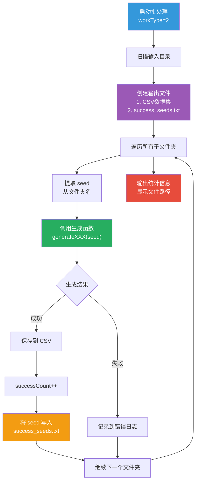
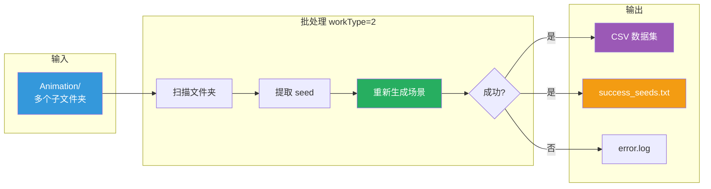
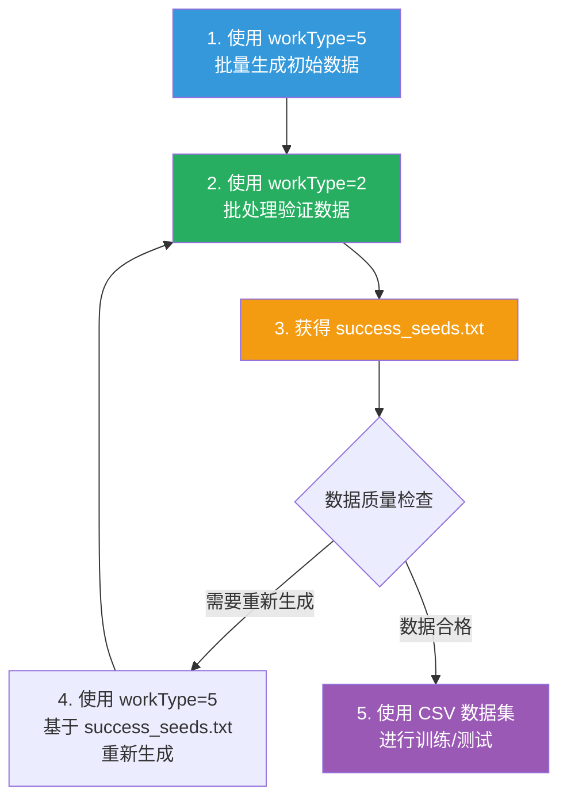

# 批处理模式使用说明

## 概述

批处理模式（`workType=2`）用于扫描已有的数据文件夹，重新生成碰撞场景并保存为 CSV 数据集。同时会记录所有成功处理的 seed 到文本文件。

## 使用方法

### 命令行格式

```bash
./generator -g 2 -i <inputDir> -t <taskType>
```

### 参数说明

| 参数 | 简写 | 说明 | 示例 |
|------|------|------|------|
| `--generate` | `-g` | 工作模式，设置为 2 | `-g 2` |
| `--input` | `-i` | 输入目录路径（包含多个子文件夹） | `-i Animation` |
| `--type` | `-t` | 任务类型（taskType） | `-t 12` |

### TaskType 对照表

| TaskType | 功能 |
|----------|------|
| 0 | FaceFace (标准FF) |
| 1-5 | EF, EE, VF, VE, VV |
| 6-11 | NearMissFF ~ NearMissVV |
| 12 | NearHitFF |
| 13 | SurfaceLineContact |
| 14 | PartiallyColinearControlPoints |
| 15 | FullyCoincidentPatches |

## 输入目录结构

批处理模式要求输入目录包含多个子文件夹，每个子文件夹的名称应包含 seed 信息：

```
Animation/
├── Animation_seed1234567890/
│   ├── two_patch.obj
│   ├── frame_0000.obj
│   └── ...
├── Animation_seed9876543210/
│   ├── two_patch.obj
│   └── ...
└── Animation_seed1111111111/
    └── ...
```

## 工作流程



## 输出文件

### 1. CSV 数据集文件

**文件名格式**：`fp_dataset_type<TaskTypeName>.csv`

**示例**：
- `fp_dataset_typeNearHitFaceFace.csv` (taskType=12)
- `fp_dataset_typeFaceFace.csv` (taskType=0)

**内容格式**：
```csv
# Dataset for collision type 12
# Format: x_numerator,x_denominator,y_numerator,y_denominator,z_numerator,z_denominator,ground_truth
# Lines 1-6: Patch1 start positions (t=1)
# Lines 7-12: Patch2 start positions (t=1)
# Lines 13-18: Patch1 end positions (t=0)
# Lines 19-24: Patch2 end positions (t=0)
1,2,3,4,5,6,1
...
```

### 2. 成功 Seed 记录文件 ⭐ **新功能**

**文件名格式**：`success_seeds_type<TaskTypeName>.txt`

**示例**：
- `success_seeds_typeNearHitFaceFace.txt` (taskType=12)
- `success_seeds_typeFaceFace.txt` (taskType=0)

**内容格式**：
```txt
# Successfully processed seeds for task type 12 (NearHitFaceFace)
# Each line contains one seed value
1234567890
9876543210
1111111111
2222222222
```

**用途**：
- 记录所有成功处理的 seed
- 可以直接用于 `workType=5` 批量重新生成
- 方便追踪哪些 seed 生成成功

### 3. 错误日志文件

**文件名**：`process_error.log`

**内容示例**：
```
Invalid seed for folder: invalid_folder_name
Generate failed for seed: 1234567890 in folder: Animation_seed1234567890
Unsupported task type: 99 for folder: Animation_seed9999999999
```

## 控制台输出

```
=== Batch Processing Mode ===
Input directory: Animation
Task type: 12

Found folder: Animation_seed1234567890
Processing Animation_seed1234567890 with seed: 1234567890
tasktype: near-hit FF
start save data
Recorded success seed: 1234567890

Found folder: Animation_seed9876543210
Processing Animation_seed9876543210 with seed: 9876543210
tasktype: near-hit FF
start save data
Recorded success seed: 9876543210

...

Batch processing complete.
Total folders processed: 10
Successful processing: 8
Dataset saved to: Animation/fp_dataset_typeNearHitFaceFace.csv
Success seeds saved to: Animation/success_seeds_typeNearHitFaceFace.txt
```

## 使用示例

### 示例 1：处理 NearHitFF 数据

```bash
# 假设已经有一些动画文件夹
./generator -g 2 -i Animation -t 12
```

**输出**：
- `Animation/fp_dataset_typeNearHitFaceFace.csv`
- `Animation/success_seeds_typeNearHitFaceFace.txt` ⭐

### 示例 2：处理标准 FF 数据

```bash
./generator -g 2 -i StandardFF_Results -t 0
```

**输出**：
- `StandardFF_Results/fp_dataset_typeFaceFace.csv`
- `StandardFF_Results/success_seeds_typeFaceFace.txt` ⭐

### 示例 3：结合 workType=5 重新生成

```bash
# 步骤1：批处理现有数据，获取成功的 seed
./generator -g 2 -i Animation -t 12

# 步骤2：使用成功的 seed 重新生成
./generator -g 5 -i Animation/success_seeds_typeNearHitFaceFace.txt -t 12 -o NewAnimation
```

## 数据流程图



## 错误处理

### 常见错误

1. **无效的文件夹名称**
   ```
   Invalid seed for folder: invalid_folder_name
   ```
   解决：确保文件夹名称包含 seed 信息（如 `Animation_seed1234567890`）

2. **生成失败（零速度）**
   ```
   Generate failed for seed: 1234567890
   ```
   解决：这是正常情况，某些 seed 可能生成无效场景，会被记录到错误日志

3. **不支持的任务类型**
   ```
   Unsupported task type: 99
   ```
   解决：检查 taskType 参数是否在 0-15 范围内

## 文件命名规则

### Seed 提取规则

从文件夹名称中提取 seed 的逻辑（`extractSeedFromFolderName` 函数）：
- 查找 `"seed"` 关键字
- 提取后面的数字部分
- 示例：`Animation_seed1234567890` → `1234567890`

### 输出文件命名

| 文件类型 | 命名规则 | 示例 |
|---------|---------|------|
| CSV 数据集 | `fp_dataset_type<TaskTypeName>.csv` | `fp_dataset_typeNearHitFaceFace.csv` |
| 成功 Seed | `success_seeds_type<TaskTypeName>.txt` | `success_seeds_typeNearHitFaceFace.txt` |
| 错误日志 | `process_error.log` | `process_error.log` |

## 性能考虑

- **处理时间**：取决于文件夹数量和 taskType 复杂度
- **磁盘空间**：CSV 文件大小取决于成功处理的数量
- **内存使用**：逐个处理文件夹，内存占用稳定

## 与其他模式的对比

| 模式 | workType | 输入 | 输出 | 用途 |
|------|----------|------|------|------|
| 单例生成 | 1 | 命令行参数 | 动画序列 | 生成单个场景 |
| **批处理** | **2** | **文件夹** | **CSV + seed列表** | **处理已有数据** |
| 恢复数据 | 4 | 无 | CSV | 恢复原始 EE |
| 批量 Seed | 5 | seed 文件 | 多个动画序列 | 批量生成场景 |

## 工作流建议

### 推荐工作流程



### 典型使用场景

1. **数据验证**：验证已生成的动画数据是否正确
2. **数据集构建**：从动画文件构建训练数据集
3. **Seed 筛选**：找出成功生成的 seed，用于后续实验
4. **数据恢复**：从备份的动画文件重建数据集

## 注意事项

1. **文件夹命名**：确保子文件夹名称包含 `seed` 关键字和数字
2. **备份机制**：如果 CSV 文件已存在，会自动备份为 `.bak` 文件
3. **追加模式**：CSV 和 success_seeds.txt 都使用追加模式，不会覆盖已有数据
4. **错误日志**：所有错误都会记录到 `process_error.log`
5. **seed 验证**：无效的 seed（如 0）会被跳过并记录

## 扩展用法

### 结合 Python 脚本分析成功率

```python
# 分析成功率
with open('success_seeds_typeNearHitFaceFace.txt', 'r') as f:
    success_seeds = [line.strip() for line in f if not line.startswith('#') and line.strip()]

print(f"Total success seeds: {len(success_seeds)}")

# 与原始 seed 列表对比
with open('original_seeds.txt', 'r') as f:
    original_seeds = [line.strip() for line in f if not line.startswith('#') and line.strip()]

success_rate = len(success_seeds) / len(original_seeds) * 100
print(f"Success rate: {success_rate:.2f}%")
```

### 过滤特定范围的 seed

```bash
# 只处理 seed 在特定范围内的文件夹
# 可以通过修改代码添加 seed 范围过滤
```

## 总结

批处理模式（`workType=2`）是一个强大的工具，用于：
- ✅ 验证已生成的数据
- ✅ 构建训练数据集
- ✅ **记录成功的 seed（新功能）**
- ✅ 追踪处理进度和错误

通过结合 `workType=5`，可以实现完整的数据生成和验证流程。
