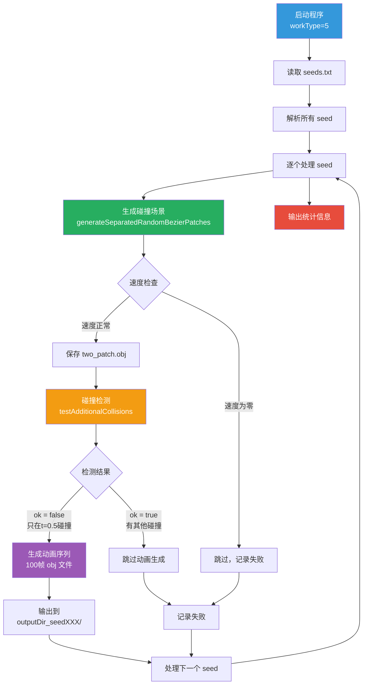

# 批量 Seed 生成模式使用说明

## 概述

批量 Seed 生成模式（`workType=5`）允许从文本文件中读取多个 seed 值，并对每个 seed 运行默认的碰撞生成流程。

## 使用方法

### 命令行格式

```bash
./generator -g 5 -i seeds.txt -t <taskType> -o <outputDir>
```

### 参数说明

| 参数 | 简写 | 说明 | 示例 |
|------|------|------|------|
| `--generate` | `-g` | 工作模式，设置为 5 | `-g 5` |
| `--input` | `-i` | 输入的 seed 文件路径 | `-i seeds.txt` |
| `--type` | `-t` | 任务类型（taskType） | `-t 12` |
| `--output` | `-o` | 输出目录 | `-o Animation` |

### TaskType 对照表

| TaskType | 功能 |
|----------|------|
| 0 | FaceFace (标准FF) |
| 1-5 | EF, EE, VF, VE, VV |
| 6-11 | NearMissFF ~ NearMissVV |
| 12 | NearHitFF |
| 13 | SurfaceLineContact |
| 14 | PartiallyColinearControlPoints |
| 15 | FullyCoincidentPatches |

## Seed 文件格式

### 基本格式

每行一个 seed 值（无符号整数）：

```
1234567890
9876543210
1111111111
2222222222
```

### 支持的特性

1. **空行**：会被自动跳过
2. **注释行**：以 `#` 开头的行会被忽略
3. **错误处理**：无效的 seed 值会被跳过并输出警告

### 示例文件

```
# 这是注释行，会被忽略
1083274353

# 测试用的 seed 列表
1234567890
9876543210

# 特殊情况测试
1111111111
2222222222
3333333333
```

## 工作流程



## 输出结构

### 目录结构

```
outputDir_seed1234567890/
├── two_patch.obj           # 初始两个 patch
├── patch1_start.obj        # patch1 起始位置
├── patch1_end.obj          # patch1 结束位置
├── patch2_start.obj        # patch2 起始位置
├── patch2_end.obj          # patch2 结束位置
├── frame_0000.obj          # 动画帧 0
├── frame_0001.obj          # 动画帧 1
├── ...
└── frame_0100.obj          # 动画帧 100

outputDir_seed9876543210/
├── ...
```

### 控制台输出

```
=== Batch Seed Generation Mode ===
Input file: seeds.txt
Task type: 12
Output directory: Animation
Total seeds to process: 5

========================================
Processing seed [1/5]: 1234567890
========================================
tasktype: near-hit FF
=== Special handling for NearHitFF (tasktype=12) ===
...
Success: Animation generated for seed 1234567890

========================================
Processing seed [2/5]: 9876543210
========================================
...

========================================
Batch seed generation completed!
Total processed: 5
Success: 3
Failed/Skipped: 2
========================================
```

## 使用示例

### 示例 1：生成 NearHitFF 场景

```bash
# 创建 seed 文件
cat > seeds.txt << EOF
1083274353
1234567890
9876543210
EOF

# 运行批量生成
./generator -g 5 -i seeds.txt -t 12 -o NearHitFF_Results
```

### 示例 2：生成标准 FF 场景

```bash
./generator -g 5 -i seeds.txt -t 0 -o StandardFF_Results
```

### 示例 3：使用带注释的 seed 文件

```bash
cat > seeds_with_comments.txt << EOF
# 已知的好 seed
1083274353

# 测试边界情况
1111111111
2222222222

# 随机生成的 seed
1234567890
9876543210
EOF

./generator -g 5 -i seeds_with_comments.txt -t 12 -o Test_Results
```

## 错误处理

### 常见错误

1. **文件不存在**
   ```
   Error: Cannot open seed file: seeds.txt
   ```
   解决：检查文件路径是否正确

2. **无效的 seed 值**
   ```
   Warning: Invalid seed value: abc123, skipping...
   ```
   解决：确保每行只包含数字

3. **零速度生成**
   ```
   Warning: Zero velocity generated for seed 1234567890, skipping...
   ```
   解决：这是正常情况，某些 seed 可能生成无效场景

4. **额外碰撞检测**
   ```
   Info: Additional collisions detected for seed 9876543210, skipping animation...
   ```
   解决：这是正常情况，表示该 seed 不满足"只在 t=0.5 碰撞"的条件

## 性能考虑

- **处理时间**：每个 seed 的处理时间取决于 taskType 和碰撞检测复杂度
- **磁盘空间**：每个成功的 seed 会生成约 100 个 obj 文件（每帧一个）
- **并行处理**：当前版本是串行处理，如需并行可以使用 `parallel_generator.py`

## 与其他模式的对比

| 模式 | workType | 用途 | 输入 | 输出 |
|------|----------|------|------|------|
| 单例生成 | 1 | 生成单个场景 | 命令行参数 | 单个动画序列 |
| 批处理文件夹 | 2 | 处理已有数据 | 文件夹路径 | CSV 文件 |
| 恢复数据 | 4 | 恢复原始 EE | 无 | CSV 文件 |
| **批量 Seed** | **5** | **批量生成场景** | **seed 文件** | **多个动画序列** |

## 注意事项

1. 确保输出目录有足够的磁盘空间
2. 大量 seed 处理可能需要较长时间
3. 建议先用少量 seed 测试，确认参数正确后再批量处理
4. 输出目录会自动创建，无需手动创建
5. 相同 seed 会覆盖之前的输出

## 扩展用法

### 结合 Python 脚本生成 seed 文件

```python
import random

# 生成 100 个随机 seed
with open('random_seeds.txt', 'w') as f:
    f.write('# Randomly generated seeds\n')
    for i in range(100):
        seed = random.randint(1000000000, 9999999999)
        f.write(f'{seed}\n')
```

### 从失败日志中提取 seed

```bash
# 假设日志中包含 "seed: 1234567890" 这样的行
grep "seed:" log.txt | awk '{print $2}' > failed_seeds.txt
```
