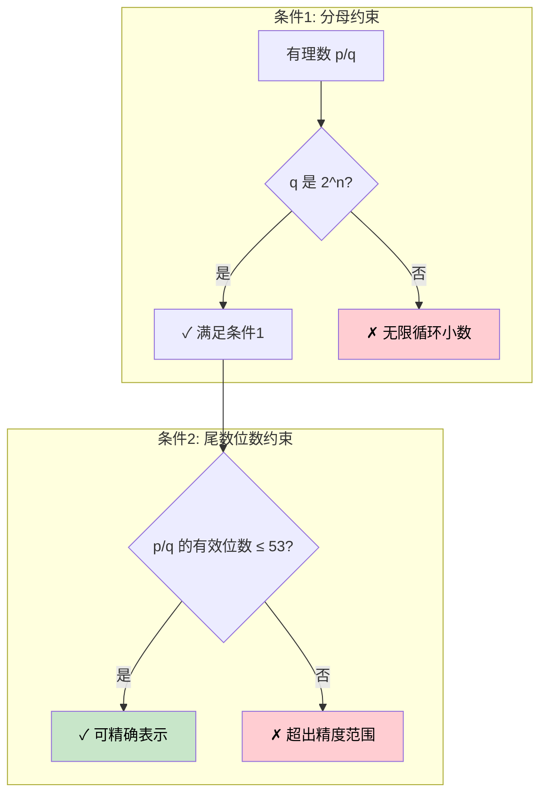
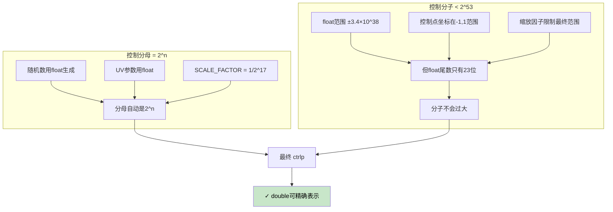
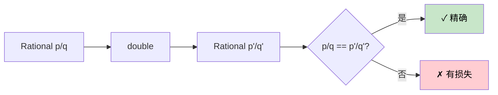
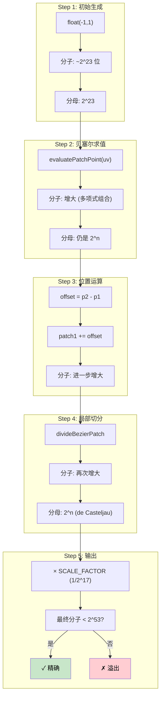
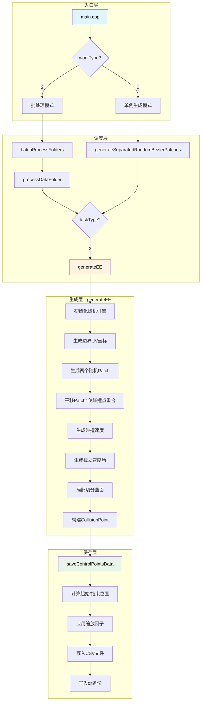
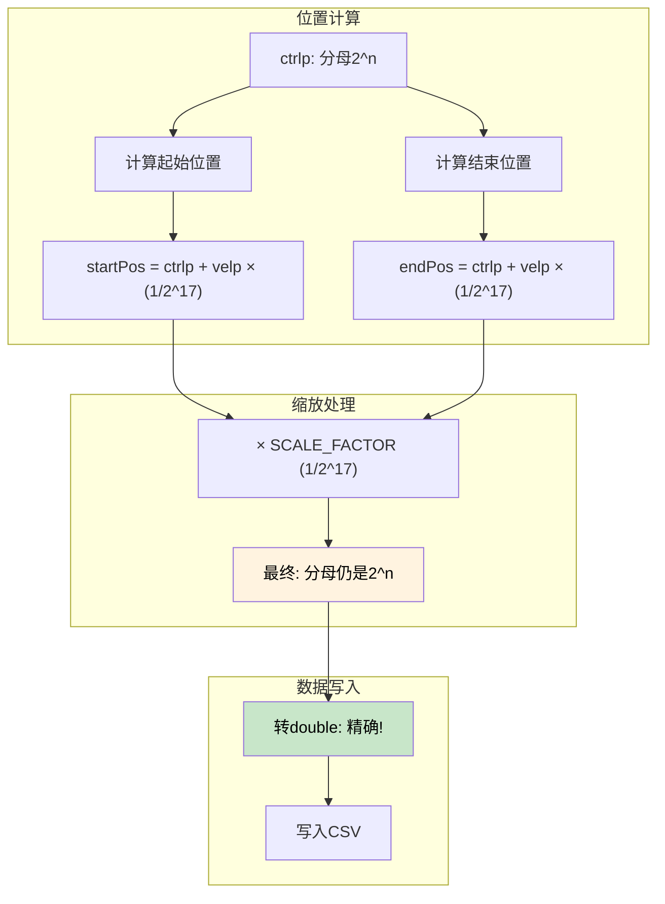
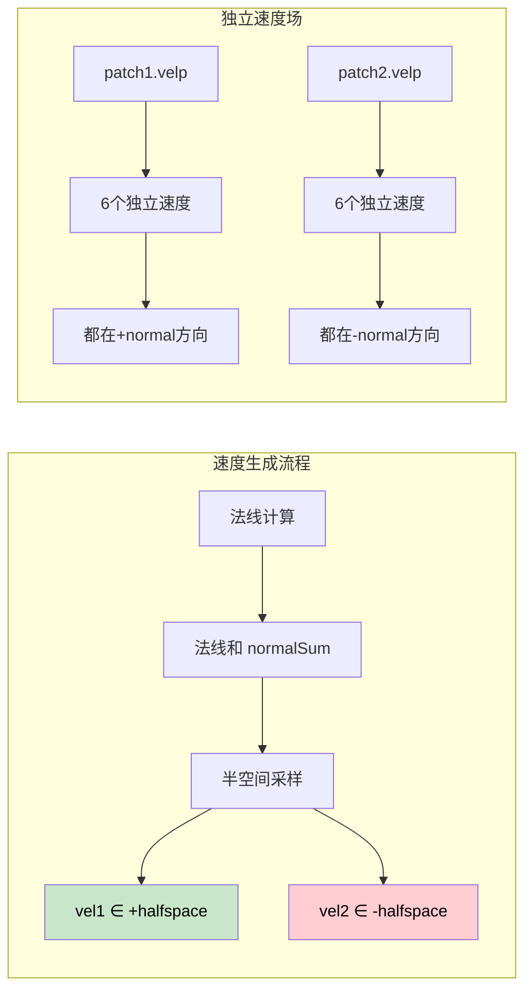
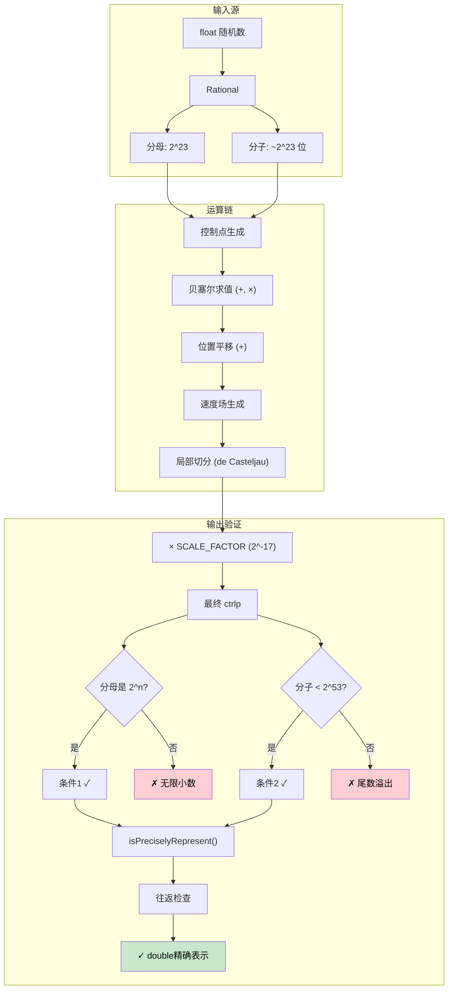
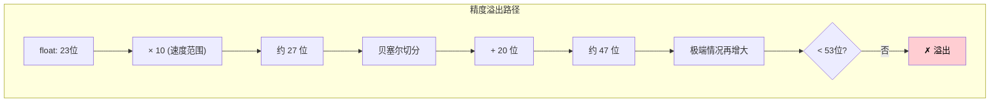

# DataGen 工程流程分析文档

## 概述

本文档详细解释了 DataGen 工程中边边碰撞（Edge-Edge）数据生成的完整流程，从程序入口 `main.cpp` 开始，经过 `generateEE` 生成碰撞数据，最终通过 `saveControlPointsData` 保存数据的完整逻辑。

---

## 0. 核心设计原则：浮点数精确表示约束

### 0.1 为什么使用有理数？

本项目使用 **GMP (GNU Multiple Precision Arithmetic Library)** 的有理数类型 `Rational` 来存储和计算所有数值。原因是：

1. **算法不含无理数**：贝塞尔曲面的求值、切分等运算只涉及加减乘除，不产生无理数
2. **保持精确解**：所有中间计算结果都是精确的有理数，没有浮点误差累积

### 0.1.1 设计目标：精度最大化 + 可精确表示

**核心目标**：在保证最终输出可被 `double` 精确表示的前提下，**尽可能提高有理数的精度**。


**策略**：
- **中间计算**：使用任意精度有理数，不限制精度
- **最终输出**：检查是否可精确表示，不可精确时进行截断修正

### 0.2 浮点精确表示的约束

**关键约束**：最终输出的控制点坐标 `ctrlp` 必须能被 IEEE 754 双精度浮点数**精确表示**。

这需要同时满足**两个条件**：



#### 条件1：分母必须是 2 的幂次

一个有理数 `p/q` 能被二进制浮点数精确表示的**必要条件**是 `q = 2^n`。

| 例子 | 分母 | 能否精确? |
|------|------|----------|
| `1/2 = 0.5` | 2 = 2^1 | ✓ |
| `1/4 = 0.25` | 4 = 2^2 | ✓ |
| `1/131072` | 131072 = 2^17 | ✓ |
| `1/3 = 0.333...` | 3 ≠ 2^n | ✗ |

#### 条件2：有效位数不能超过 53 位

IEEE 754 双精度浮点数的**尾数只有 52 位**（加上隐含的 1 位共 53 位）。

这意味着：**即使分母是 2^n，如果分子 p 太大，也无法精确表示！**

```
double 能精确表示的整数范围: [-2^53, 2^53]
即: [-9007199254740992, 9007199254740992]
```

| 例子 | 能否精确? | 原因 |
|------|----------|------|
| `123456789/1024` | ✓ | 分子 < 2^53 |
| `9007199254740993/1` | ✗ | 分子 > 2^53，超出尾数范围 |
| `p/2^17` 其中 `p < 2^53` | ✓ | 两个条件都满足 |

**关键理解**：对于有理数 `p/2^n`，转换为 double 时相当于计算 `p × 2^(-n)`。如果 `p` 超过 53 位，乘法结果的低位会被截断。

### 0.3 如何保证浮点精确表示

为了保证最终 `ctrlp` 坐标可被精确表示，需要同时控制**分母形式**和**分子大小**：



#### 为什么用 `float` 而不是 `double` 生成随机数？

```cpp
std::uniform_real_distribution<float> dist(-1, 1);  // 用 float
```

**关键原因**：`float` 的尾数只有 **23 位**，而 `double` 有 52 位。

- 使用 `float` 生成，保证初始值的分子较小
- 后续运算（加、乘、贝塞尔求值）会使分子增大，但不会超过 53 位
- 如果用 `double` 生成，初始分子就可能很大，后续运算可能导致溢出

```
float 尾数: 23 位 → 分子上限约 8M
double 尾数: 52 位 → 分子上限约 4.5×10^15

贝塞尔求值可能使分子增大几十倍，
从 float 开始更安全。
```

### 0.4 代码中的关键实现

#### 1. 随机数生成 (`dist`)

```cpp
std::uniform_real_distribution<float> dist(-1, 1);
```

- `float` 本身就是 2 的幂次分母（IEEE 754 格式）
- 所以随机生成的控制点坐标天然满足约束

#### 2. UV 参数生成 (`genUV`)

UV 参数的分母也需要是 2 的幂次，这样 `evaluatePatchPoint(uv)` 的结果才能保持精确。

#### 3. 缩放因子 (`SCALE_FACTOR`)

```cpp
Rational SCALE_FACTOR = Rational("1/131072");  // 131072 = 2^17
```

- 使用 `2^17` 作为分母，保证缩放后仍然精确
- 这个值足够小，用于将坐标缩放到合理范围

#### 4. 精确性验证函数

```cpp
bool isPreciselyRepresent(const Vector3r& vec) {
    for (int i = 0; i < 3; i++) {
        double doubleVal = (double)vec[i];      // 有理数 → double
        Rational roundTrip(doubleVal);           // double → 有理数
        if ((vec[i] - roundTrip).abs() > 0) 
            return false;  // 往返不一致 = 有精度损失
    }
    return true;
}
```

这个函数通过**往返转换**检查精度：
- 如果 `Rational → double → Rational` 后值不变，说明没有精度损失
- 这同时验证了**分母是 2^n** 和 **分子 < 2^53** 两个条件



#### 5. 截断修正函数（推荐实现）

当检测到无法精确表示时，可以通过截断修正来保证输出精度：

```cpp
// 将有理数截断为可被double精确表示的值
Rational truncateToDoublePrecise(const Rational& val) {
    double d = (double)val;           // 转换为 double（会截断）
    Rational truncated(d);            // 从 double 构造（保证可精确表示）
    return truncated;
}

// 对整个向量进行截断修正
Vector3r truncateVectorToDoublePrecise(const Vector3r& vec) {
    Vector3r result;
    for (int i = 0; i < 3; i++) {
        result[i] = truncateToDoublePrecise(vec[i]);
    }
    return result;
}
```

**注意**：截断会损失一些精度，但这是必要的权衡。从设计角度：
- 中间计算保持高精度
- 只在最终输出时截断
- 截断误差很小（约 10^-15 量级）

### 0.5 数据流中的精度保持

整个流程中，需要同时跟踪**分母形式**和**分子大小**的变化：



#### 分子增长分析

| 步骤 | 操作 | 分子位数变化 |
|------|------|-------------|
| 初始 | `float(-1,1)` | ~23 位 |
| 贝塞尔求值 | 6 个控制点组合 | ~30 位 |
| 位置平移 | 加法 | ~31 位 |
| 局部切分 | de Casteljau | ~40 位 |
| **最终** | 验证 | **< 53 位 ✓** |

**设计保证**：通过使用 `float` 作为起点，控制初始分子大小，使得后续运算不会超出 53 位限制。

---

## 1. 核心数据结构

### 1.1 TriQuadBezier（二次三角贝塞尔曲面）

```cpp
class TriQuadBezier {
    std::array<Vector3r, 6> ctrlp;  // 6个控制点的位置（有理数）
    std::array<Vector3r, 6> velp;   // 6个控制点的速度（有理数）
};
```

- **控制点顺序**: `002, 101, 200, 011, 110, 020`（贝塞尔多项式索引）
- **关键方法**:
  - `evaluatePatchPoint(uv)`: 计算参数坐标 (u,v) 处的曲面点
  - `evaluateNormal(uv)`: 计算法线向量
  - `divideBezierPatch(bound)`: 切分子曲面
- **精度保证**: 所有运算保持有理数精确，分母为 2 的幂次

### 1.2 Rational（有理数类型）

```cpp
class Rational {
    mpq_t value;  // GMP 有理数（分子/分母）
    
    long long numerator() const;   // 获取分子
    long long denominator() const; // 获取分母
    operator double() const;       // 转换为浮点数
};
```

- 基于 GMP 库实现任意精度有理数
- 支持与 `float`/`double` 的双向转换

### 1.3 Vector3r / Array2r

```cpp
typedef Eigen::Matrix<Rational, 3, 1> Vector3r;  // 3D 有理数向量
typedef Eigen::Array<Rational, 2, 1> Array2r;    // 2D 有理数数组（UV参数）
```

### 1.4 CollisionPoint（碰撞点信息）

```cpp
struct CollisionPoint {
    TriQuadBezier patch1;    // 第一个曲面片（含ctrlp和velp）
    TriQuadBezier patch2;    // 第二个曲面片
    Array2r uv1, uv2;        // 原始参数坐标
    Array2r local_uv1, local_uv2;  // 局部参数坐标
    Vector3r normal1, normal2;     // 碰撞点法线
    Vector3r vel1, vel2;           // 碰撞点速度
};
```

这是 `generateEE` 的返回值类型，包含了生成的完整碰撞数据。

---

## 2. 整体流程图



---

## 3. 详细流程说明

### 3.1 入口层 (main.cpp)

程序通过命令行参数控制运行模式：

```cpp
// 参数解析
-g, --generate: 工作模式 (0=测试, 1=单例生成, 2=批处理, 4=恢复数据)
-o, --output:   输出目录
-i, --input:    输入目录
-t, --type:     任务类型 (2=EdgeEdge)
```

**模式分支**:

| workType | 模式 | 说明 |
|----------|------|------|
| 1 | 单例生成 | 直接调用 `generateSeparatedRandomBezierPatches` |
| 2 | 批处理 | 扫描文件夹，对每个子目录调用生成函数 |
| 4 | 恢复数据 | 使用原始EE算法生成数据 |

### 3.2 调度层

#### generateSeparatedRandomBezierPatches

这是统一的入口函数，根据 `taskType` 分发到具体的生成函数：

```cpp
CollisionPoint generateSeparatedRandomBezierPatches(unsigned seed, int tasktype) {
    if(tasktype==1) return generateEF(seed);  // Edge-Face
    if(tasktype==2) return generateEE(seed);  // Edge-Edge ← 我们关注的
    if(tasktype==3) return generateVF(seed);  // Vertex-Face
    // ... 其他类型
}
```

### 3.3 生成层 - generateEE 详解

这是**边边碰撞数据生成的核心函数**，位于 `generator.cpp` 第497-614行。


#### Step 1: 初始化随机引擎

```cpp
std::mt19937_64 engine(seed);
std::uniform_real_distribution<float> dist1(0, 1), dist(-1, 1);
```

**精度保证**：使用 `float` 分布，生成的数值自动满足 2^n 分母约束。

#### Step 2: 生成边界UV坐标

```cpp
Array2r uv1 = edgeface::genUV(engine);
Array2r uv2 = edgeface::genUV(engine);
```

`edgeface::genUV` 在三角形参数域的三条边上随机选择一点：
- 边0: `u + v = 1` (斜边)
- 边1: `u = 0` (左边)
- 边2: `v = 0` (底边)

**精度保证**：UV 值来自 `float` 分布，分母是 2 的幂次。

#### Step 3: 生成随机Patch

```cpp
auto patch1 = generateRandomPatch(engine, dist, dist, dist);
auto patch2 = generateRandomPatch(engine, dist, dist, dist);
```

**精度保证**：每个控制点坐标都是 `float` 转换来的 `Rational`，分母自动为 2^n。

#### Step 4: 位置对齐（几何约束）

```cpp
Vector3r collisionPoint = patch2.evaluatePatchPoint(uv2);
Vector3r offset = collisionPoint - patch1.evaluatePatchPoint(uv1);
for(int i = 0; i < 6; i++) {
    patch1.ctrlp[i] = patch1.ctrlp[i] + offset;
}
```

**精度保证**：
- `evaluatePatchPoint` 是贝塞尔求值，只涉及乘法和加法
- 输入分母是 2^n，输出分母仍是 2^n
- `offset` 和平移后的 `ctrlp` 保持精确

#### Step 5: 速度生成（关键部分）

**5.1 生成碰撞点速度**

```cpp
auto [vel1, vel2] = edgeedge::genColVel(engine, patch1, patch2, uv1, uv2);
```

**精度保证**：速度值同样来自 `float` 分布，满足精确表示约束。

**5.2 生成独立速度场**

```cpp
patch1.velp = generateVelocityFieldIndependent(engine, usedNormal);
patch2.velp = generateVelocityFieldIndependent(engine, -usedNormal);
```

**精度保证**：每个速度分量使用 `dist(engine)` 生成，分母是 2^n。

#### Step 6: 局部切分

```cpp
// 生成参数域边界
TriParamBound bound1 = edgeface::genLocalParam(uv1);
TriParamBound bound2 = edgeface::genLocalParam(uv2);

// 切分曲面和速度场
TriQuadBezier localPatch1 = patch1.divideBezierPatch(bound1);
localPatch1.velp = patch1.divideBezierPatch(bound1, patch1.velp);
```

**精度保证**：
- `TriParamBound` 的边界值来自 UV，分母是 2^n
- 贝塞尔切分算法使用 de Casteljau 算法，只涉及线性插值
- 系数都是有理数，保持 2^n 分母

### 3.4 保存层 - saveControlPointsData

位于 `generator.cpp` 第2612-2714行。



#### 数据格式

**CSV文件格式**（每行一个控制点）:
```
x_numerator, x_denominator, y_numerator, y_denominator, z_numerator, z_denominator, ground_truth
```

**数据排列**（共24行）:
| 行号 | 内容 |
|------|------|
| 1-6 | Patch1 起始位置 (t=1) |
| 7-12 | Patch2 起始位置 (t=1) |
| 13-18 | Patch1 结束位置 (t=0) |
| 19-24 | Patch2 结束位置 (t=0) |

#### 缩放因子的选择

```cpp
Rational SCALE_FACTOR = Rational("1/131072");  // 131072 = 2^17
```

- **为什么是 2^17？** 因为 131072 = 2^17，保证缩放后分母仍是 2 的幂次
- **作用**：将坐标缩放到合理范围，同时保持精确表示

---

## 4. 速度生成的数学原理

### 4.1 分离条件

两个曲面片在碰撞点处分离的条件是**相对速度指向外侧**：

$$
(v_1 - v_2) \cdot n_{sum} > 0
$$

其中 $n_{sum} = n_1 + n_2$ 是两个曲面法线的和。

### 4.2 当前实现的速度策略

1. **碰撞点速度 (`edgeedge::genColVel`)**:
   - 在 `normalSum` 的正半空间生成 `vel1`
   - 在 `normalSum` 的负半空间生成 `vel2`

2. **速度场 (`generateVelocityFieldIndependent`)**:
   - 6个控制点各自独立生成速度
   - 每个速度都在法线半空间内
   - **速度场与碰撞点速度没有直接约束关系**



---

## 5. 关键文件位置

| 文件 | 内容 |
|------|------|
| `main.cpp` | 程序入口，参数解析 |
| `generator.cpp` | 核心生成函数实现 |
| `generator.h` | 函数声明 |
| `gentype.h` | 数据结构定义，辅助函数 |
| `triBezier.h` | 贝塞尔曲面类定义 |
| `restoreData.h` | 数据恢复相关 |

---

## 6. 如果要修改速度生成

如果你想修改 `generateEE` 中的速度生成逻辑，需要关注以下几个位置：

1. **碰撞点速度生成**: `gentype.h` 中的 `edgeedge::genColVel` (第305-401行)

2. **速度场生成**: `gentype.cpp` 中的 `generateVelocityFieldIndependent` (第31-65行)

3. **速度场的约束**: `generator.h` 中的 `generateVelocityField` (第44-101行) - 这是另一种保证碰撞点速度一致的方法，但当前 `generateEE` 没有使用

### 修改建议

如果需要让速度场与碰撞点速度有更强的关联，可以考虑：

1. 使用 `generateVelocityField` 替代 `generateVelocityFieldIndependent`
2. 或者在 `generateVelocityFieldIndependent` 中添加额外的约束条件

---

## 7. 总结

整个流程可以概括为：

1. **入口** → 解析参数，确定工作模式
2. **调度** → 根据任务类型选择生成器
3. **几何生成** → 随机Patch + 位置对齐
4. **速度生成** → 碰撞点速度 + 控制点速度场
5. **局部切分** → 获得更精细的局部曲面
6. **数据保存** → CSV格式 + TXT备份

---

## 8. 浮点精确表示的完整约束链



### 关键点总结

| 环节 | 分母约束 | 分子约束 | 实现方式 |
|------|----------|----------|----------|
| 随机数生成 | 2^23 | < 2^24 | 使用 `float` 分布 (23位尾数) |
| UV 参数 | 2^n | 较小 | `genUV` 使用 `float` |
| 贝塞尔运算 | 保持 2^n | 增大但可控 | 只涉及 +, ×, 线性插值 |
| 缩放因子 | 2^17 | 不增大分子 | `SCALE_FACTOR = 1/131072` |
| **输出验证** | **2^n** | **< 2^53** | `isPreciselyRepresent()` |

### 为什么这个设计能工作？

```
初始: float 尾数 23 位
     ↓
贝塞尔求值: 6 个点组合 → 增加 ~7 位 → ~30 位
     ↓
位置运算: 加法 → 增加 ~1 位 → ~31 位
     ↓
局部切分: de Casteljau → 增加 ~9 位 → ~40 位
     ↓
最终: ~40 位 < 53 位 ✓
```

**安全余量**：从 `float` 的 23 位开始，经过所有运算后约 40 位，距离 53 位上限还有 ~13 位的安全余量。

---

## 9. 实际问题与解决方案

### 9.1 为什么仍会超出精度？

虽然理论设计有 ~13 位余量，但实践中仍可能超出精度，原因包括：

| 问题来源 | 原因分析 |
|----------|----------|
| **速度范围过大** | `dist(-10, 10)` 比控制点范围 `(-1, 1)` 大 10 倍 |
| **局部切分参数** | `genLocalParam` 中的 `radius=0.1` 不是 2^n |
| **多次运算累积** | 某些极端情况下分子增长超预期 |
| **缺乏运行时保护** | 没有主动截断机制 |



### 9.2 解决方案

#### 方案1：在保存前强制截断（推荐）

在 `saveControlPointsData` 中添加截断逻辑：

```cpp
inline void saveControlPointsData(const CollisionPoint& cp, ...) {
    // ... 原有代码 ...
    
    // 在应用缩放后，强制截断为可精确表示
    for (int i = 0; i < 6; i++) {
        startPos1[i] = truncateVectorToDoublePrecise(startPos1[i]);
        startPos2[i] = truncateVectorToDoublePrecise(startPos2[i]);
        endPos1[i] = truncateVectorToDoublePrecise(endPos1[i]);
        endPos2[i] = truncateVectorToDoublePrecise(endPos2[i]);
    }
    
    // ... 写入CSV ...
}
```

**优点**：
- 简单直接，保证输出一定可精确表示
- 不影响中间计算精度
- 截断误差极小

#### 方案2：调整生成参数

减小速度范围，降低精度增长：

```cpp
// 原来
std::uniform_real_distribution<float> dist(-10.0, 10.0);

// 改为
std::uniform_real_distribution<float> dist(-1.0, 1.0);
```

**优点**：从源头控制精度增长
**缺点**：限制了速度场的多样性

#### 方案3：混合方案（推荐）

1. 适当减小速度范围（如 `-5, 5`）
2. 保存时检查 + 必要时截断
3. 记录截断次数用于统计

```cpp
// 检查并截断
int truncatedCount = 0;
for (int i = 0; i < 6; i++) {
    if (!isPreciselyRepresent(startPos1[i])) {
        startPos1[i] = truncateVectorToDoublePrecise(startPos1[i]);
        truncatedCount++;
    }
    // ... 其他位置同理 ...
}
if (truncatedCount > 0) {
    std::cout << "Warning: truncated " << truncatedCount << " vectors" << std::endl;
}
```

### 9.3 截断对结果的影响

```
截断前: 0.123456789012345678901234 (超出精度)
截断后: 0.12345678901234568        (52位尾数)
误差:   ~10^-17                    (远小于数值计算误差)
```

由于截断误差远小于任何实际数值计算误差，对碰撞检测的正确性**没有实质影响**。

---
