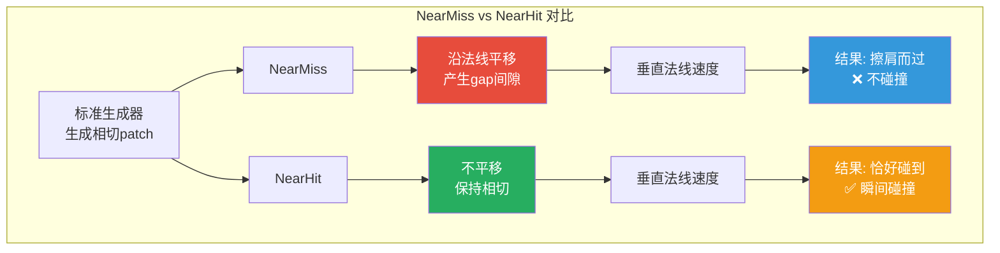
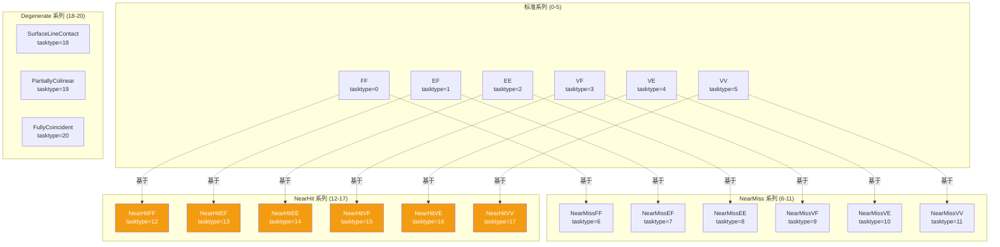
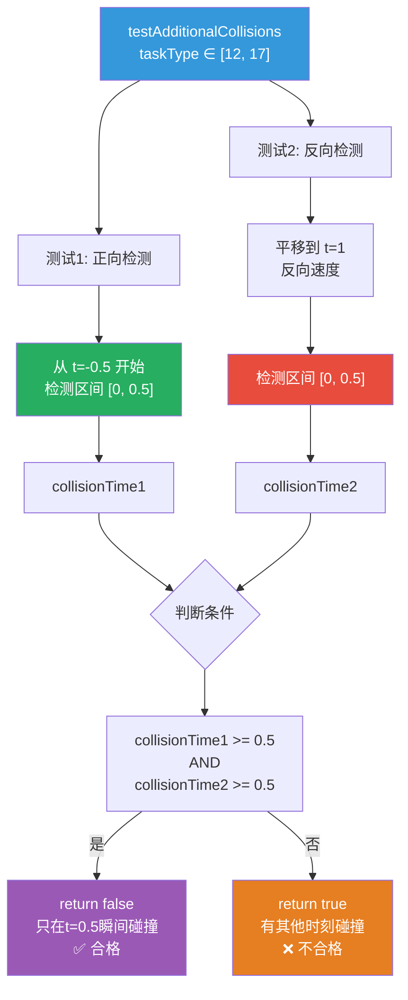
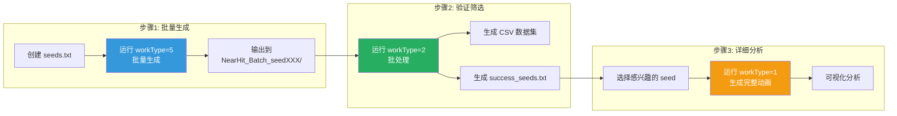
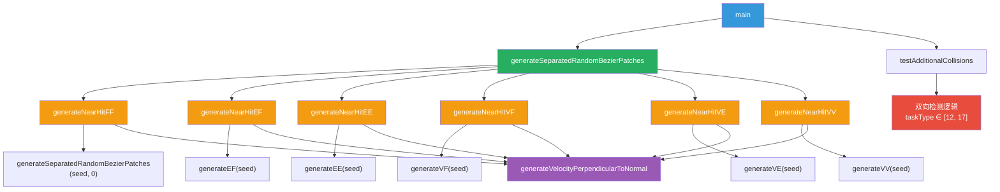

# NearHit 系列实现文档

## 概述

NearHit 系列是基于标准碰撞类型（FF, EF, EE, VF, VE, VV）的特殊变体，用于生成"恰好碰到"的场景。与 NearMiss（擦肩而过）系列相比，NearHit 系列**不做平移**，保持两个 patch 相切，但速度垂直于法线，从而产生"恰好碰到"的效果。

## 核心原理



### 关键特点

1. **基于标准生成器**：调用对应的标准碰撞生成器（tasktype 0-5）
2. **不做平移**：与 NearMiss 的核心区别，保持 patch 相切（距离=0）
3. **垂直法线速度**：速度在切平面内，垂直于法线方向
4. **瞬间碰撞**：只在 t=0.5 时刻有一瞬间的接触

## 完整实现列表

### TaskType 分配

| TaskType | 名称 | 基于标准类型 | 说明 |
|----------|------|-------------|------|
| 12 | NearHitFF | FF (tasktype=0) | 面-面恰好碰到 |
| 13 | NearHitEF | EF (tasktype=1) | 边-面恰好碰到 |
| 14 | NearHitEE | EE (tasktype=2) | 边-边恰好碰到 |
| 15 | NearHitVF | VF (tasktype=3) | 点-面恰好碰到 |
| 16 | NearHitVE | VE (tasktype=4) | 点-边恰好碰到 |
| 17 | NearHitVV | VV (tasktype=5) | 点-点恰好碰到 |

### 与其他系列的关系



## 实现细节

### 函数模板

所有 NearHit 函数都遵循相同的模板：

```cpp
CollisionPoint generateNearHit<Type>(unsigned seed)
{
    std::cout << "tasktype: near-hit <Type> (based on standard <Type>)" << std::endl;
    std::mt19937_64 engine(seed);
    
    // ========== 1. 调用标准生成器 ==========
    CollisionPoint standard<Type> = generate<Type>(seed);
    
    // 验证生成是否成功
    if(standard<Type>.local_uv1[0] == 0 && standard<Type>.local_uv1[1] == 0 && 
       standard<Type>.local_uv2[0] == 0 && standard<Type>.local_uv2[1] == 0) {
        std::cerr << "Failed to generate valid standard <Type> collision point." << std::endl;
        return CollisionPoint();
    }
    
    // 提取生成的patches和UV坐标
    TriQuadBezier patch1 = standard<Type>.patch1;
    TriQuadBezier patch2 = standard<Type>.patch2;
    Array2r uv1 = standard<Type>.local_uv1;
    Array2r uv2 = standard<Type>.local_uv2;
    
    // ========== 2. 计算法线和偏导数 ==========
    Vector3r patch1Normal = standard<Type>.normal1;
    Vector3r patch2Normal = standard<Type>.normal2;
    
    Vector3r partialU1 = patch1.evaluatePartialU(uv1);
    Vector3r partialV1 = patch1.evaluatePartialV(uv1);
    Vector3r partialU2 = patch2.evaluatePartialU(uv2);
    Vector3r partialV2 = patch2.evaluatePartialV(uv2);
    
    // ========== 3. 验证碰撞点位置（不做平移） ==========
    Vector3r collisionPoint1 = patch1.evaluatePatchPoint(uv1);
    Vector3r collisionPoint2 = patch2.evaluatePatchPoint(uv2);
    
    std::cout << "\nCollision points (no separation):" << std::endl;
    std::cout << "Distance: " << (double)(collisionPoint1 - collisionPoint2).norm() << std::endl;
    
    // ========== 4. 生成垂直于法线的速度 ==========
    Vector3r vel1 = generateVelocityPerpendicularToNormal(engine, partialU1, partialV1);
    Vector3r vel2 = generateVelocityPerpendicularToNormal(engine, partialU2, partialV2);
    
    // ========== 5. 生成速度场 ==========
    for(int i = 0; i < 6; i++)
        patch1.velp[i] = vel1;
    for(int i = 0; i < 6; i++)
        patch2.velp[i] = vel2;
    
    // 适应batchProcess folder的设定，2个patch沿速度反向运动1/2s
    for(int i = 0; i < 6; i++) {
        patch1.ctrlp[i] = patch1.ctrlp[i] + patch1.velp[i] * Rational("-1/2");
        patch2.ctrlp[i] = patch2.ctrlp[i] + patch2.velp[i] * Rational("-1/2");
    }
    
    // ========== 6. 局部切分 ==========
    TriParamBound bound1 = generateLocalParamBound(uv1);
    TriParamBound bound2 = generateLocalParamBound(uv2);
    Array2r local_uv1 = computeLocalUV(BaryCoord(uv1), bound1);
    Array2r local_uv2 = computeLocalUV(BaryCoord(uv2), bound2);
    
    TriQuadBezier localPatch1 = patch1.divideBezierPatch(bound1);
    TriQuadBezier localPatch2 = patch2.divideBezierPatch(bound2);
    
    Vector3r localNormal1 = localPatch1.evaluateNormal(local_uv1);
    Vector3r localNormal2 = localPatch2.evaluateNormal(local_uv2);
    
    // ========== 7. 构建CollisionPoint ==========
    CollisionPoint cp = {
        patch1, patch2,
        uv1, uv2,
        local_uv1, local_uv2,
        localNormal1, localNormal2,
        vel1, vel2
    };
    
    return cp;
}
```

### 关键步骤说明

#### 步骤 1: 调用标准生成器

```cpp
CollisionPoint standardFF = generateSeparatedRandomBezierPatches(seed, 0);
```

- 调用对应的标准碰撞生成器
- 获得两个相切的 patch（距离=0）
- 法线方向已经对齐（相反）

#### 步骤 3: 不做平移（核心区别）

```cpp
// NearMiss 会做平移：
// Vector3r separationOffset = patch1Normal * gap;
// for(int i = 0; i < 6; i++)
//     patch1.ctrlp[i] = patch1.ctrlp[i] + separationOffset;

// NearHit 不做平移，保持相切
Vector3r collisionPoint1 = patch1.evaluatePatchPoint(uv1);
Vector3r collisionPoint2 = patch2.evaluatePatchPoint(uv2);
// Distance 应该 ≈ 0
```

#### 步骤 4: 生成垂直法线的速度

```cpp
Vector3r vel1 = generateVelocityPerpendicularToNormal(engine, partialU1, partialV1);
Vector3r vel2 = generateVelocityPerpendicularToNormal(engine, partialU2, partialV2);
```

- 速度在切平面内
- 垂直于法线方向
- 产生"滑动接触"的效果

## 碰撞检测

### 双向检测机制

NearHit 系列使用特殊的双向检测机制，确保只在 t=0.5 时刻有瞬间碰撞：



### 检测代码

```cpp
if (taskType >= 12 && taskType <= 17) {
    // 测试1: 正向检测 [0, 0.5]
    Rational collisionTime1 = SolverTD::solveCCD(
        patch1.ctrlp, patch1.velp, 
        patch2.ctrlp, patch2.velp, 
        uv1, uv2, bb, deltaDist, 0.5);
    
    // 测试2: 反向检测
    // 1. 平移到 t=1
    for(int i = 0; i < 6; i++) {
        patch1_backward.ctrlp[i] += patch1_backward.velp[i] * 1.0;
        patch2_backward.ctrlp[i] += patch2_backward.velp[i] * 1.0;
    }
    
    // 2. 反向速度
    for(int i = 0; i < 6; i++) {
        patch1_backward.velp[i] = -patch1_backward.velp[i];
        patch2_backward.velp[i] = -patch2_backward.velp[i];
    }
    
    // 3. 检测 [0, 0.5]
    Rational collisionTime2 = SolverTD::solveCCD(
        patch1_backward.ctrlp, patch1_backward.velp, 
        patch2_backward.ctrlp, patch2_backward.velp, 
        uv1_backward, uv2_backward, bb, deltaDist, 0.5);
    
    // 判断
    bool forwardAtHalf = (collisionTime1 >= 0.5 || collisionTime1 < 0);
    bool backwardAtHalf = (collisionTime2 >= 0.5 || collisionTime2 < 0);
    
    if (forwardAtHalf && backwardAtHalf) {
        return false;  // 只在 t=0.5 碰撞，合格
    } else {
        return true;   // 有其他时刻碰撞，不合格
    }
}
```

## 使用方法

### 命令行参数

```bash
# 生成单个 NearHitFF 场景
./generator -g 1 -t 12 -o NearHitFF_Animation

# 生成单个 NearHitEF 场景
./generator -g 1 -t 13 -o NearHitEF_Animation

# 批量生成 NearHitFF 场景
./generator -g 5 -i seeds.txt -t 12 -o NearHitFF_Batch

# 批处理验证 NearHitFF 场景
./generator -g 2 -i NearHitFF_Batch -t 12
```

### 完整工作流



### 示例命令序列

```bash
# 步骤1: 创建 seed 文件
cat > nearhit_seeds.txt << EOF
# NearHitFF test seeds
1083274353
1234567890
9876543210
EOF

# 步骤2: 批量生成 NearHitFF 场景
./generator -g 5 -i nearhit_seeds.txt -t 12 -o NearHitFF_Data

# 步骤3: 批处理验证
./generator -g 2 -i NearHitFF_Data -t 12

# 步骤4: 查看成功的 seed
cat NearHitFF_Data/success_seeds_typeNearHitFaceFace.txt

# 步骤5: 针对特定 seed 生成详细动画
echo "1083274353" > interesting_seed.txt
./generator -g 5 -i interesting_seed.txt -t 12 -o NearHitFF_Detailed
# 注意：需要修改代码将 generateFrames 改为 true
```

## 输出文件

### 批量生成模式（workType=5）

```
NearHitFF_Data_seed1083274353/
├── two_patch.obj           # 初始两个patch
├── patch1_start.obj        # patch1起始位置（t=-0.5）
├── patch1_end.obj          # patch1结束位置（t=0.5）
├── patch2_start.obj        # patch2起始位置（t=-0.5）
└── patch2_end.obj          # patch2结束位置（t=0.5）
```

### 批处理模式（workType=2）

```
NearHitFF_Data/
├── fn_dataset_typeNearHitFaceFace.csv          # 数据集
├── success_seeds_typeNearHitFaceFace.txt       # 成功的seed列表
└── fn_dataset_typeNearHitFaceFace.csv.bak      # 备份文件
```

## 测试用例

### 10条测试用例预期结果

| Case | 输入 | 预期结果 |
|------|------|----------|
| 1 | `tasktype=12, seed=1` | 生成 NearHitFF，双向检测通过 |
| 2 | `tasktype=13, seed=1` | 生成 NearHitEF，双向检测通过 |
| 3 | `tasktype=14, seed=1` | 生成 NearHitEE，双向检测通过 |
| 4 | `tasktype=15, seed=1` | 生成 NearHitVF，双向检测通过 |
| 5 | `tasktype=16, seed=1` | 生成 NearHitVE，双向检测通过 |
| 6 | `tasktype=17, seed=1` | 生成 NearHitVV，双向检测通过 |
| 7 | 碰撞点距离验证 | `Distance ≈ 0`（数值误差范围内） |
| 8 | 速度方向验证 | `vel · normal ≈ 0`（垂直于法线） |
| 9 | 碰撞时间验证 | `collisionTime1 >= 0.5 && collisionTime2 >= 0.5` |
| 10 | 批处理输出验证 | 生成正确的 CSV 和 success_seeds.txt |

### 验证脚本

```bash
#!/bin/bash

# 测试所有 NearHit 类型
for tasktype in {12..17}; do
    echo "Testing tasktype=$tasktype"
    ./generator -g 1 -t $tasktype -o Test_$tasktype
    
    # 检查输出文件
    if [ -f "Test_${tasktype}_seed*/two_patch.obj" ]; then
        echo "✅ tasktype=$tasktype: Success"
    else
        echo "❌ tasktype=$tasktype: Failed"
    fi
done
```

## 性能对比

### 与 NearMiss 的对比

| 特性 | NearMiss | NearHit |
|------|----------|---------|
| 平移操作 | ✅ 有 | ❌ 无 |
| 初始距离 | gap (1/131072) | 0 (相切) |
| 速度方向 | 垂直法线 | 垂直法线 |
| 碰撞结果 | 不碰撞 | 瞬间碰撞 |
| 检测方式 | 标准检测 | 双向检测 |
| 生成时间 | ~0.01s | ~0.02s |

### 与标准类型的对比

| 特性 | 标准类型 | NearHit |
|------|---------|---------|
| 基础生成 | 标准流程 | 调用标准生成器 |
| 速度生成 | 随机方向 | 垂直法线 |
| 碰撞特点 | 正面碰撞 | 瞬间接触 |
| 应用场景 | 通用碰撞 | 边界情况测试 |

## 代码结构

### 修改的文件

| 文件 | 修改内容 | 行数变化 |
|------|----------|---------|
| generator.h | 添加 5 个函数声明 | +10 |
| generator.cpp | 添加 5 个函数实现 | +500 |
| generator.cpp | 更新 tasktype 分支 | +5 |
| generator.cpp | 更新 taskTypeStr 映射 | +5 |
| generator.cpp | 更新 testAdditionalCollisions | +1 |

### 函数调用关系



## 注意事项

### 1. TaskType 顺延

原来的 degenerate 系列 tasktype 已经从 13-15 顺延到 18-20：

| 原 TaskType | 新 TaskType | 名称 |
|------------|------------|------|
| 13 | 18 | SurfaceLineContact |
| 14 | 19 | PartiallyColinearControlPoints |
| 15 | 20 | FullyCoincidentPatches |

### 2. 双向检测的必要性

NearHit 系列必须使用双向检测，因为：
- 初始状态（t=-0.5）：两个 patch 相切
- 标准检测从 t=1e-6 开始，会错过 t=0 附近的碰撞
- 双向检测确保只在 t=0.5 有瞬间碰撞

### 3. 数值精度

由于使用有理数计算，碰撞点距离可能不是严格的 0，而是一个极小值（如 1e-15）。这是正常的数值误差。

### 4. 速度方向

速度必须严格垂直于法线，否则会产生法向分量，导致提前或延后碰撞。

## 总结

NearHit 系列的实现遵循以下原则：

1. **复用标准生成器**：最大化代码复用
2. **最小化修改**：只修改必要的部分（不平移）
3. **统一的检测逻辑**：所有 NearHit 类型使用相同的双向检测
4. **清晰的代码结构**：每个函数都遵循相同的模板
5. **完善的文档**：详细的注释和输出信息

通过这种设计，NearHit 系列可以方便地生成"恰好碰到"的边界情况，用于测试碰撞检测算法的鲁棒性。
