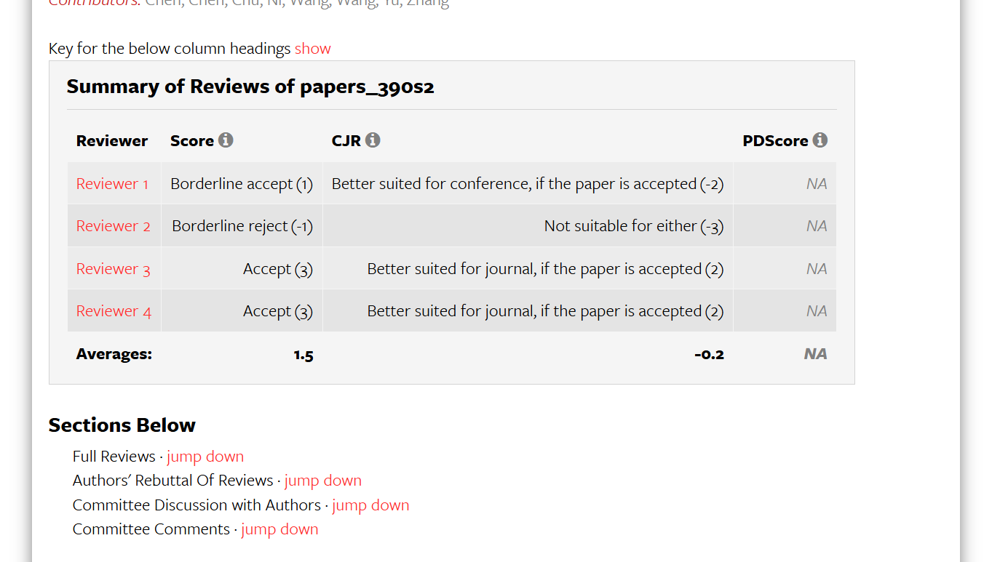
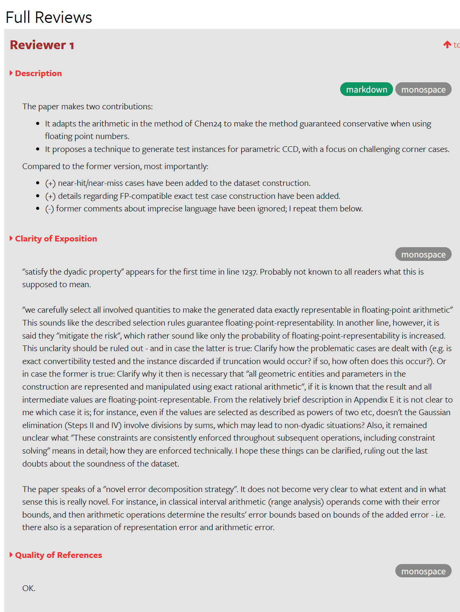
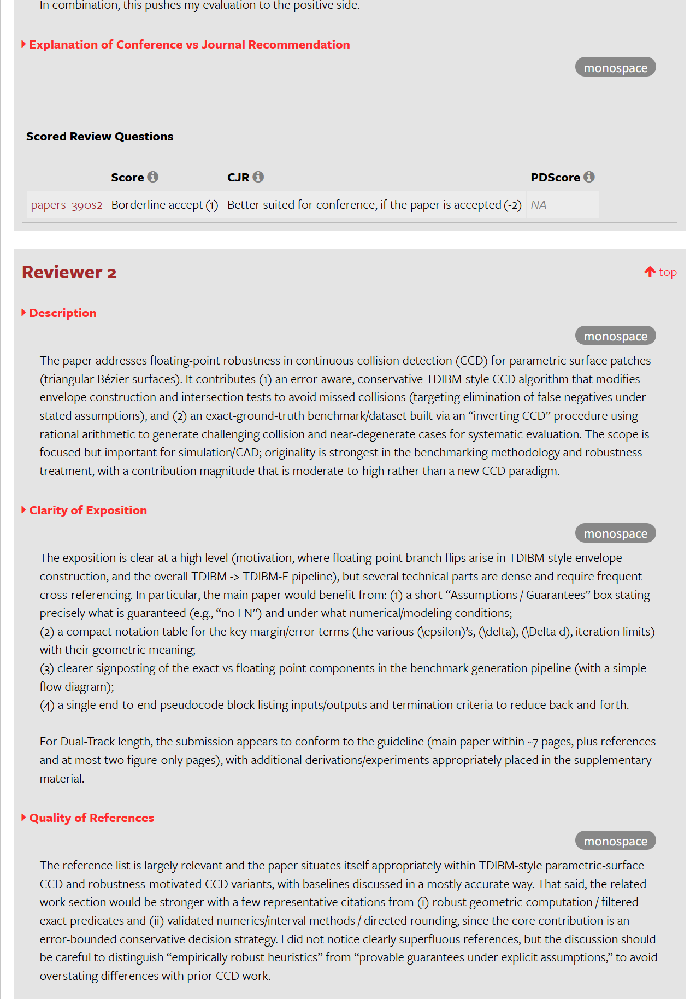
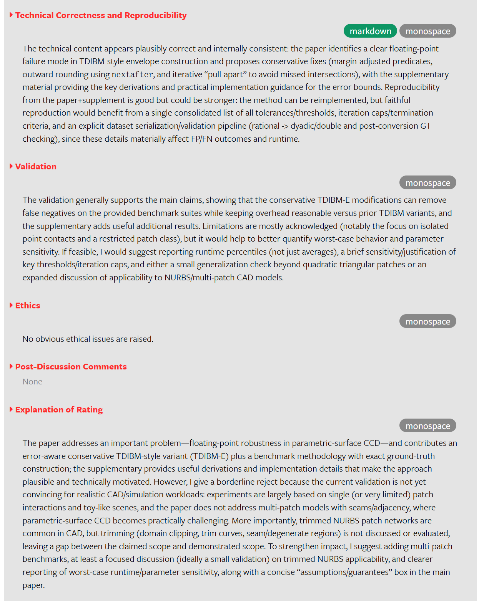
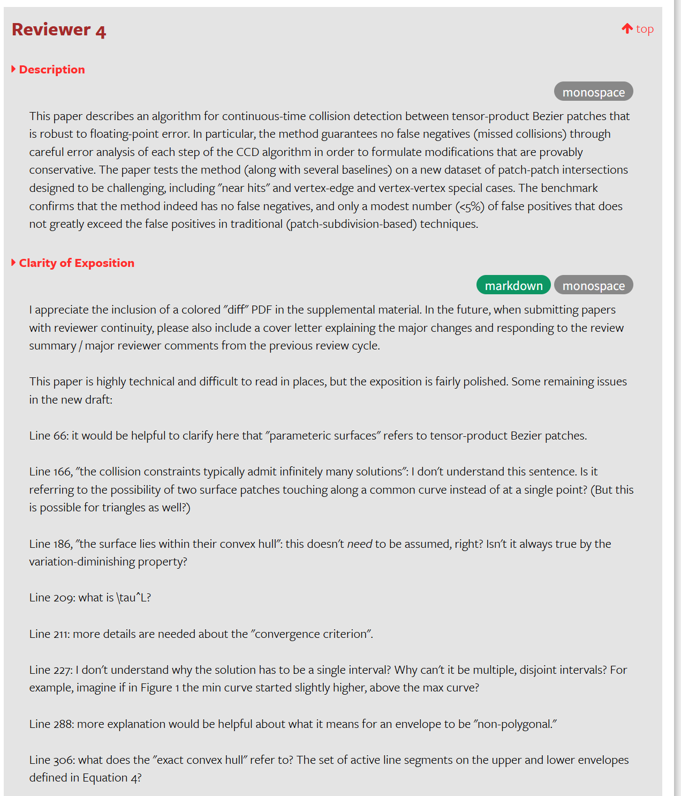
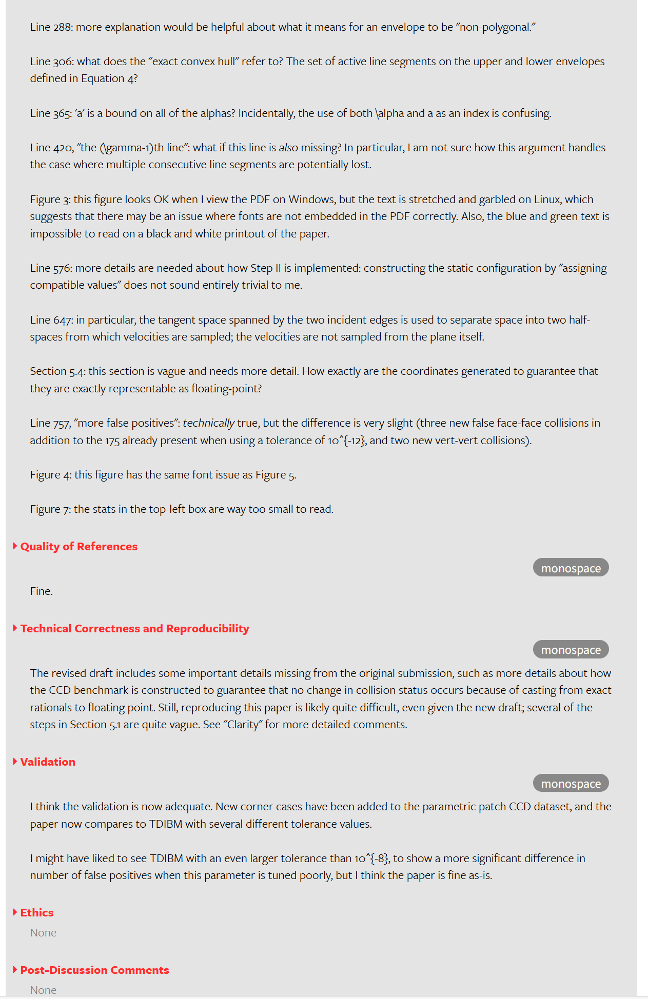
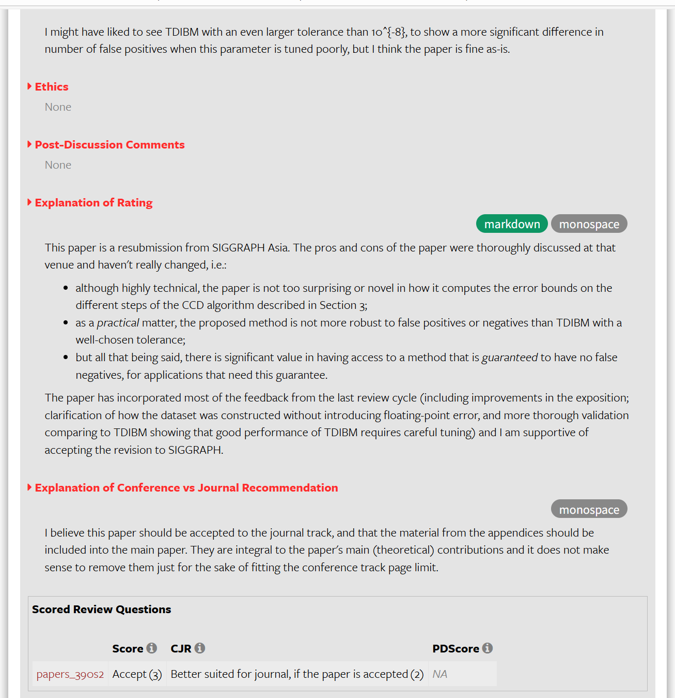
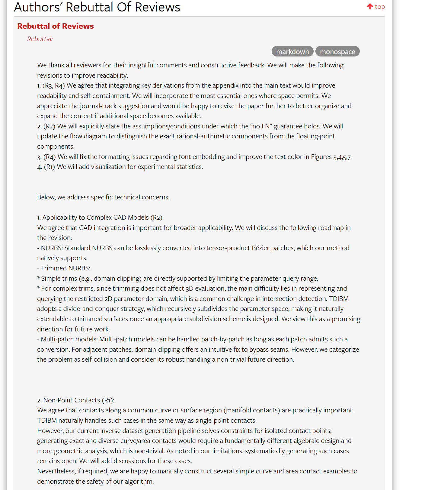
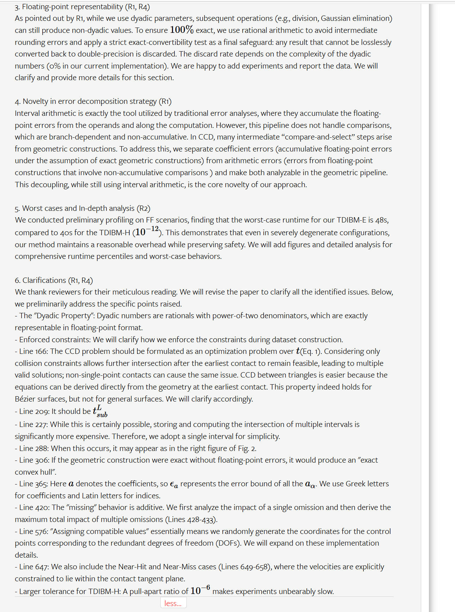
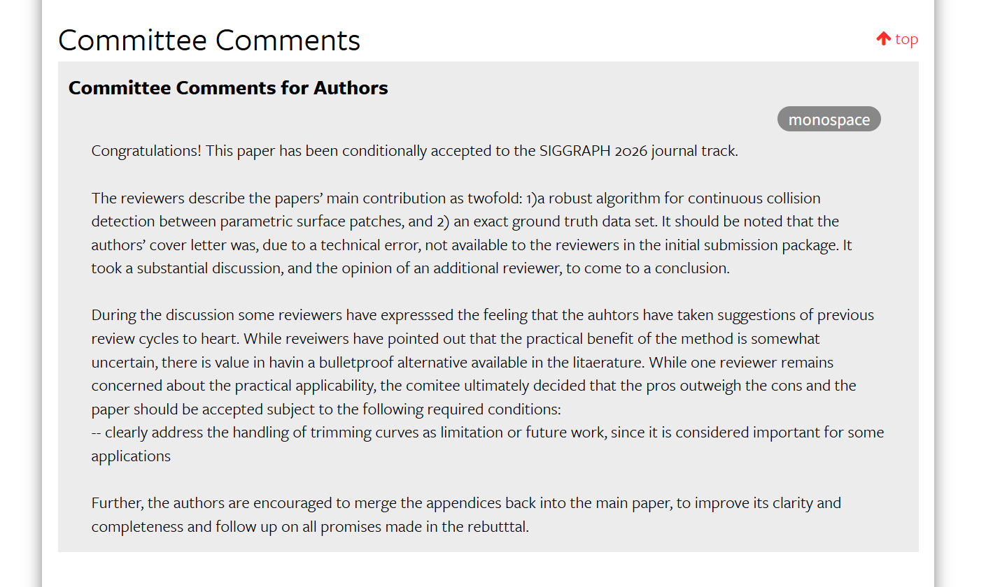

# Review

# our rebuttal:
We thank all reviewers for their insightful comments and constructive feedback. We will make the following revisions to improve readability:
1. (R3, R4) We agree that integrating key derivations from the appendix into the main text would improve readability and self-containment. We will incorporate the most essential ones where space permits. We appreciate the journal-track suggestion and would be happy to revise the paper further to better organize and expand the content if additional space becomes available.
2. (R2) We will explicitly state the assumptions/conditions under which the "no FN" guarantee holds. We will update the flow diagram to distinguish the exact rational-arithmetic components from the floating-point components.
3. (R4) We will fix the formatting issues regarding font embedding and improve the text color in Figures 3,4,5,7.
4. (R1) We will add visualization for experimental statistics.

Below, we address specific technical concerns.

1. Applicability to Complex CAD Models (R2)
We agree that CAD integration is important for broader applicability. We will discuss the following roadmap in the revision:
- NURBS: Standard NURBS can be losslessly converted into tensor-product Bézier patches, which our method natively supports.
- Trimmed NURBS:
* Simple trims (e.g., domain clipping) are directly supported by limiting the parameter query range.
* For complex trims, since trimming does not affect 3D evaluation, the main difficulty lies in representing and querying the restricted 2D parameter domain, which is a common challenge in intersection detection. TDIBM adopts a divide-and-conquer strategy, which recursively subdivides the parameter space, making it naturally extendable to trimmed surfaces once an appropriate subdivision scheme is designed. We view this as a promising direction for future work.
- Multi-patch models: Multi-patch models can be handled patch-by-patch as long as each patch admits such a conversion. For adjacent patches, domain clipping offers an intuitive fix to bypass seams. However, we categorize the problem as self-collision and consider its robust handling a non-trivial future direction.

2. Non-Point Contacts (R1):
We agree that contacts along a common curve or surface region (manifold contacts) are practically important. TDIBM naturally handles such cases in the same way as single-point contacts.
However, our current inverse dataset generation pipeline solves constraints for isolated contact points; generating exact and diverse curve/area contacts would require a fundamentally different algebraic design and more geometric analysis, which is non-trivial. As noted in our limitations, systematically generating such cases remains open. We will add discussions for these cases.
Nevertheless, if required, we are happy to manually construct several simple curve and area contact examples to demonstrate the safety of our algorithm.

3. Floating-point representability (R1, R4)
As pointed out by R1, while we use dyadic parameters, subsequent operations (e.g., division, Gaussian elimination) can still produce non-dyadic values. To ensure 
100
%
 exact, we use rational arithmetic to avoid intermediate rounding errors and apply a strict exact-convertibility test as a final safeguard: any result that cannot be losslessly converted back to double-precision is discarded. The discard rate depends on the complexity of the dyadic numbers (0% in our current implementation). We are happy to add experiments and report the data. We will clarify and provide more details for this section.

4. Novelty in error decomposition strategy (R1)
Interval arithmetic is exactly the tool utilized by traditional error analyses, where they accumulate the floating-point errors from the operands and along the computation. However, this pipeline does not handle comparisons, which are branch-dependent and non-accumulative. In CCD, many intermediate “compare-and-select” steps arise from geometric constructions. To address this, we separate coefficient errors (accumulative floating-point errors under the assumption of exact geometric constructions) from arithmetic errors (errors from floating-point constructions that involve non-accumulative comparisons ) and make both analyzable in the geometric pipeline. This decoupling, while still using interval arithmetic, is the core novelty of our approach.

5. Worst cases and In-depth analysis (R2)
We conducted preliminary profiling on FF scenarios, finding that the worst-case runtime for our TDIBM-E is 48s, compared to 40s for the TDIBM-H (
10
−
12
). This demonstrates that even in severely degenerate configurations, our method maintains a reasonable overhead while preserving safety. We will add figures and detailed analysis for comprehensive runtime percentiles and worst-case behaviors.

6. Clarifications (R1, R4)
We thank reviewers for their meticulous reading. We will revise the paper to clarify all the identified issues. Below, we preliminarily address the specific points raised.
- The "Dyadic Property": Dyadic numbers are rationals with power-of-two denominators, which are exactly representable in floating-point format.
- Enforced constraints: We will clarify how we enforce the constraints during dataset construction.
- Line 166: The CCD problem should be formulated as an optimization problem over 
t
(Eq. 1). Considering only collision constraints allows further intersection after the earliest contact to remain feasible, leading to multiple valid solutions; non-single-point contacts can cause the same issue. CCD between triangles is easier because the equations can be derived directly from the geometry at the earliest contact. This property indeed holds for Bézier surfaces, but not for general surfaces. We will clarify accordingly.
- Line 209: It should be 
t
L
s
u
b

- Line 227: While this is certainly possible, storing and computing the intersection of multiple intervals is significantly more expensive. Therefore, we adopt a single interval for simplicity.
- Line 288: When this occurs, it may appear as in the right figure of Fig. 2.
- Line 306: If the geometric construction were exact without floating-point errors, it would produce an "exact convex hull".
- Line 365: Here 
a
 denotes the coefficients, so 
ϵ
a
 represents the error bound of all the 
a
α
. We use Greek letters for coefficients and Latin letters for indices.
- Line 420: The "missing" behavior is additive. We first analyze the impact of a single omission and then derive the maximum total impact of multiple omissions (Lines 428-433).
- Line 576: "Assigning compatible values" essentially means we randomly generate the coordinates for the control points corresponding to the redundant degrees of freedom (DOFs). We will expand on these implementation details.
- Line 647: We also include the Near-Hit and Near-Miss cases (Lines 649-658), where the velocities are explicitly constrained to lie within the contact tangent plane.
- Larger tolerance for TDIBM-H: A pull-apart ratio of 
10
−
6
 makes experiments unbearably slow.
 

 

# final comment
